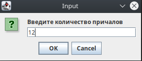
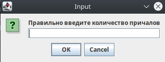
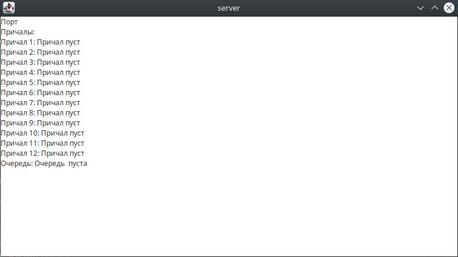
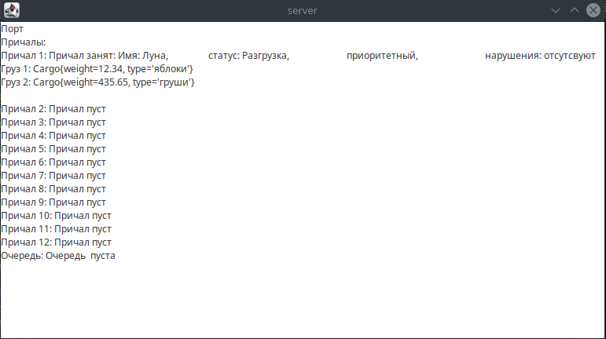
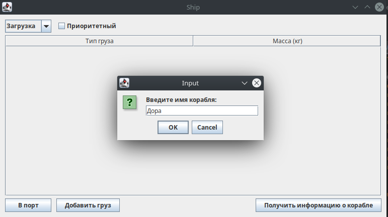
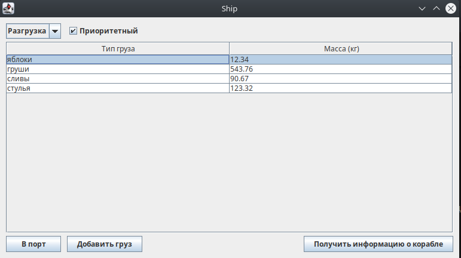
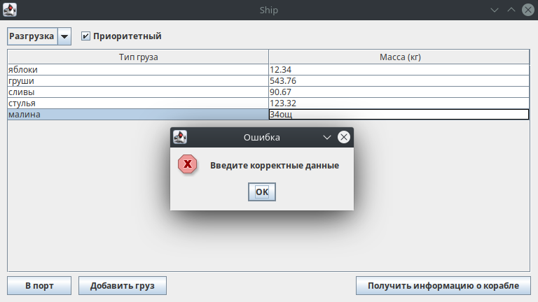
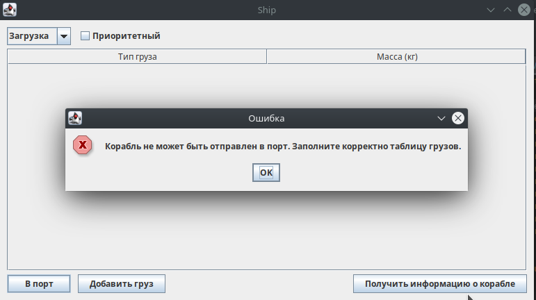
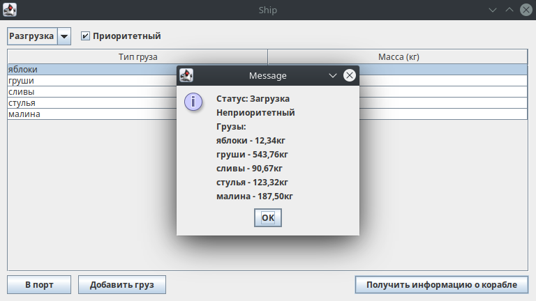

# Требования к проекту
---

# Содержание
1. [Введение](#intro)
    1. [Назначение](#appointment)
    2. [Бизнес-требования](#business_requirements)
        1. [Исходные данные](#initial_data)
        2. [Возможности бизнеса](#business_opportunities)
        3. [Границы проекта](#project_boundary)
2. [Требования пользователя](#user_requirements)
2.1 [Программные интерфейсы](#software_interfaces)
2.2 [Интерфейс пользователя](#user_interface)
2.3 [Характеристики пользователей](#user_specifications)
2.3.1 [Классы пользователей](#user_classes)
2.3.2 [Аудитория приложения](#application_audience)
2.3.2.1 [Целевая аудитория](#target_audience)
2.4 [Предположения и зависимости](#assumptions_and_dependencies)
3. [Системные требования](#system_requirements)
3.1 [Функциональные требования](#functional_requirements)
3.1.1 [Основные функции](#main_functions)
3.1.1.1 [Ввод данных](#input_data)
3.1.1.2 [Отправка на сервер](#send_to_server)
3.1.1.3 [Получение информации](#get_info)
3.1.1.4 [Подтверждение окончания загрузки/выгрузки](#finish_work)
3.1.2 [Ограничения и исключения](#restrictions_and_exclusions)
3.2 [Нефункциональные требования](#non-functional_requirements)
3.2.1 [Атрибуты качества](#quality_attributes)
3.2.1.1 [Требования к удобству использования](#requirements_for_ease_of_use)
3.2.1.2 [Требования к безопасности](#security_requirements)
3.2.2 [Внешние интерфейсы](#external_interfaces)

# 1 Введение

## 1.1 Назначение
В документе описаны требования пользователя и системные требования к клиент-серверному приложению "Портовая диспетчерская система". Данный документ предназначен для команд разработчиков, которые будут реализовывать и тестировать работу приложения.

## 1.2 Бизнес-требования

### 1.2.1 Исходные данные
Морские грузоперевозки не теряют актуальность в настоящее время в связи с отсутствием сухопутных путей между странами. Существует множество компаний, которые специализируются на морских грузоперевозках, однако многие из них до сих пор не механизировали данный процесс, что затрудняет работу с прибывающими в порт грузовыми кораблями. Решением данной проблемы является приложение, которое регестрирует корабли в портах на загрузку и(или) выгрузку, заносит в очередь в соответствии с приоритетами, важностью и срочностью грузов, прошлой статистикой корабля(нарушения, если они имеются).

### 1.2.2 Возможности бизнеса
Компании, занимающиеся грузоперевозками, нуждаются в "Портовой диспетчерской системе" с простым и удобным пользовательским интерфейсом. Данное приложение предоставит возможность быстро и легко решать проблемы распределения нагрузки между причалами и приоритетов между кораблями, позволит избегать возникновения очередей в портах. Правильно спроектированный интерфейс позволит увеличить количество компаний, использующих "Портовую диспетчерскую систему".

### 1.2.3 Границы проекта
"Портовая диспетчерская система" облегчит работу компаниям, которые занимаются морскими грузоперевозками, а также ускорит процессы выгрузки/загрузки кораблей.

# 2 Требования пользователя

## 2.1 Программные интерфейсы
Приложение предназначено для работы в средах операционных систем Linux, Windows. Для написания приложения используется язык программирования Java. Среда разработки - IntelliJ IDEA. GUI клиента и сервера реализуются с помощью графической библиотеки Swing.

## 2.2 Интерфейс пользователя
При входе в программу пользователю предоставляется возможность ввести количество причалов порта. При некорректном вводе следует повторить попытку.

После корректного ввода появляется окно сервера с причалами и информацией об очереди. Сервер обновляется каждые 5 секунд. Можно видеть состояние очереди, а также её занятость.

При запуске клиентской части требуется ввести ввести имя корабля. Данное поле не является обязательным.

После ввода имени появляется форма клиентской части. Там можно выбрать, куда плывёт корабль(загрузка/разгрузка), приоритетный ли он везёт груз или нет. Обязательным для заполнения являются поля грузов. Для добавления груза надо нажать на кнопку "Добавить груз". Поля с грузами требуется заполнить корректно: сначала название, потом масса в кг. После окончании регистрации корабля следует нажать на кнопку в левом нижнем углу "В порт", чтобы корабль отправился в порт. В любой момент можно получить информацию о корабле. Для этого неоюходимо нажать кнопку в правом нижнем углу "Получить информацию о корабле".

## 2.3 Характеристики пользователей

### 2.3.1 Классы пользователей

Приложение не разделяет пользователей на группы, предоставляя каждому одниковый функционал.

### 2.3.2 Аудитория приложения

#### 2.3.2.1 Целевая аудитория
Люди любой возрастной категории, обладающие минимальной компьютерной грамотностью и работающие в области морских грузоперевозок.

# 3 Системные требования

## 3.1 Функциональные требования

### 3.1.1 Основные функции

#### 3.1.1.1 Ввод данных
Пользователь имеет возможность ввести данные для установки количества причалов, имени кораблей, грузов.

#### 3.1.1.2 Отправка на сервер
Пользователь имеет возможность отправить данные о корабле с грузами и основными характеристиками на сервер.

#### 3.1.1.3 Получение информации
Пользователь имеет возможность получать информацию о корабле в любой момент времени.

#### 3.1.1.4 Подтверждение окончания загрузки/выгрузки
Пользователь имеет возможность подтвержать окончание работы с сервером.

### 3.1.2 Ограничения и исключения
1. Проверка на корректность ввода количества причалов.
2. Проверка на корректный ввод груза.
3. Проверка на корректность заполнения информации о корабле перед его отправкой на сервер.
4. Ограничение на создание более одного корабля за раз.

## 3.2 Нефункциональные требования

### 3.2.1 Атрибуты качества

#### 3.2.1.1 Требования к удобству использования
1. Доступ ко всем операциям в одном окне;
2. Все функциональные элементы пользовательского интерфейса имеют названия, описывающие действие, которое произойдет при выборе элемента;
3. Доступность. Данное приложение не разработано для людей с ограниченными возможностями, т.к. является узкопрофильным. Однако для человека, который работает в области морских грузоперевозок, оно доступно.
4. Приложение точно и не допускат ошибок в процессе работы.
5. Приложение надёжно. Доступно только компаниям, работающим с ним.
